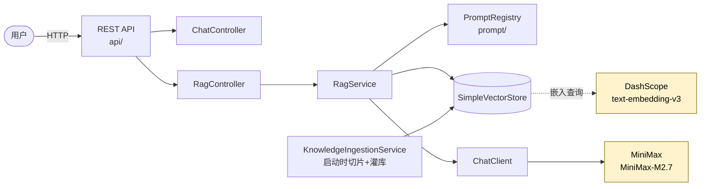

# enterprise-ai-blueprint

**企业级 AI 应用工程化参考实现** · *Enterprise AI Application Engineering Blueprint*

> Built with Spring AI · 多模型聚合 · Prompt 即代码 · Docker 一键启动

[](LICENSE)
[](https://spring.io/projects/spring-boot)
[](https://spring.io/projects/spring-ai)
[](https://openjdk.org/projects/jdk/17/)

---

## 这是什么

一个**可直接运行**的企业级 AI 应用工程化参考实现。用一个"企业知识库 RAG 问答"场景作为载体，演示生产环境 AI 应用应该具备的工程能力：

- 🔌 **多模型聚合**：chat 走 MiniMax、embedding 走 DashScope，纯 YAML 配置即可切换厂商
- 📝 **Prompt 即代码**：模板带 frontmatter 元数据、版本化管理、灰度切换
- 🧩 **RAG 工程化**：知识切片 + 向量检索 + Prompt 注入 + 思考块剥离，完整链路
- 🌍 **多环境配置**：dev / prod profile 自动切换 prompt 版本（灰度发布的最朴素实现）
- 🐳 **生产级 Docker**：multi-stage 构建、非 root 用户、健康检查、Maven 缓存层
- 📊 **可观测性基线**：Spring Boot Actuator + 调用链日志

## 这不是什么

- ❌ 不是 RAG 入门教程（如果你刚接触 RAG，看 [Spring AI 官方文档](https://docs.spring.io/spring-ai/reference/) 更合适）
- ❌ 不是开箱即用的 SaaS 产品
- ❌ 不是 AI 网关（用 [OneAPI](https://github.com/songquanpeng/one-api) / [LiteLLM](https://github.com/BerriAI/litellm) 更对路）

**它是**：一份"我做企业 AI 落地时，希望一开始就有的脚手架"。

---

## 5 分钟 Quickstart

### 前置

- Docker Desktop（macOS / Windows / Linux 都行）
- **任意一对 OpenAI 兼容的 chat + embedding API Key**——本项目**不绑死任何厂商**，下文给出默认 + 多组替代方案：
  - **默认（最便宜，国内可直连）**：[MiniMax](https://platform.minimaxi.com/) chat + [阿里通义 DashScope](https://bailian.console.aliyun.com/) embedding
  - 替代：DeepSeek、智谱 GLM、月之暗面 Kimi、OpenAI 等任意 OpenAI 兼容厂商（见下文 [切换厂商](#切换-chat--embedding-厂商)）

### 一行启动

```bash
git clone https://github.com/rocky8023/enterprise-ai-blueprint.git
cd enterprise-ai-blueprint
cp compose.env.example .env
# 编辑 .env，至少填入 BLUEPRINT_CHAT_API_KEY 和 BLUEPRINT_EMBEDDING_API_KEY
docker-compose up --build
```

首次构建 5-10 分钟（拉镜像 + 下依赖），之后改代码再 build 30 秒。

### 三条 curl 验证

```bash
# 1. 健康检查
curl http://localhost:8080/actuator/health
# 期待: {"status":"UP"}

# 2. 知识库内问题（v1 默认）
curl -G "http://localhost:8080/api/rag/ask" --data-urlencode "q=年假怎么算"

# 3. 切换 Prompt v2（同问题，输出风格完全不同）
curl -G "http://localhost:8080/api/rag/ask" \
  --data-urlencode "q=年假怎么算" \
  --data-urlencode "promptVersion=v2"
```

### 切换 chat / embedding 厂商

**不需要改代码、不需要重新构建镜像，只改 `.env` 三个变量**：

```bash
# === 用 DeepSeek 做 chat（embedding 保持 DashScope）===
BLUEPRINT_CHAT_API_KEY=sk-xxx
BLUEPRINT_CHAT_BASE_URL=https://api.deepseek.com
BLUEPRINT_CHAT_MODEL=deepseek-chat

# === 用 OpenAI 做 chat（如果你能翻墙）===
BLUEPRINT_CHAT_API_KEY=sk-xxx
BLUEPRINT_CHAT_BASE_URL=https://api.openai.com
BLUEPRINT_CHAT_MODEL=gpt-4o-mini

# === 用智谱 GLM 做 chat ===
BLUEPRINT_CHAT_API_KEY=xxx
BLUEPRINT_CHAT_BASE_URL=https://open.bigmodel.cn/api/paas/v4
BLUEPRINT_CHAT_MODEL=glm-4.5
```

完整厂商列表 + embedding 切换示例见 [`compose.env.example`](compose.env.example)。

> 💡 **原理**：所有变量最终注入到 Spring AI 的 `spring.ai.openai.{chat,embedding}.{api-key,base-url,options.model}`，只要厂商提供 OpenAI 兼容接口就能跑。这就是 "多模型聚合" 的最朴素形态——**配置即聚合**。

---

## 架构



**分层原则**：

| 包 | 职责 |
|---|---|
| `api/` | REST 接口层，只做参数校验与编排转发 |
| `rag/` | RAG 业务编排（检索 + Prompt 注入 + 生成） |
| `prompt/` | Prompt 注册表、模板定义、元数据解析 |
| `config/` | Spring Bean 装配（VectorStore、ChatClient） |
| `infra/llm/` | 多模型聚合层（v1.0 通过 Spring AI YAML 配置实现，v1.1 抽象统一接口） |

---

## 核心特性逐条

### 1. 多模型聚合（纯 YAML）

Spring AI 的 OpenAI client `chat` 和 `embedding` 配置**可独立**，继承自同一个父类。所以你可以：

```yaml
spring:
  ai:
    openai:
      chat:
        api-key: ${MINIMAX_API_KEY:}
        base-url: https://api.minimaxi.com
        options:
          model: MiniMax-M2.7
      embedding:
        api-key: ${DASHSCOPE_API_KEY:}
        base-url: https://dashscope.aliyuncs.com/compatible-mode
        options:
          model: text-embedding-v3
```

**零 Java 代码，纯配置就实现"chat 一家、embedding 另一家"**。这是 Spring AI 被低估的能力。

### 2. Prompt 即代码（frontmatter 元数据）

`src/main/resources/prompts/*.md`：

```markdown
---
key: rag.company-qa
version: v2
author: rocky8023
description: 改良版，无表格 + 分点 + 限字数
status: beta
based_on: v1
examples:
  - question: 年假怎么算
    expected_keywords: ["5 天", "leave_policy"]
---

你是企业知识助手。请基于【知识库】回答【用户问题】...

【知识库】
{context}

【用户问题】
{question}
```

**Prompt 是代码 → 它就应该有 metadata + 自带测试用例**。`PromptRegistry` 启动时扫描 + 解析 + 注册，运行时通过 `?promptVersion=v2` 灰度。

### 3. RAG 完整链路

```
用户问题 → DashScope 嵌入 → SimpleVectorStore 相似度检索 (top-K)
   ↓
Prompt 模板渲染 (context + question) → MiniMax 生成
   ↓
<think>...</think> 推理块剥离 → 返回 answer + sources + promptUsed
```

每次调用日志记录使用的 prompt fullId（`rag.company-qa@v2`），便于回溯。

### 4. 多环境配置 = 最朴素的灰度

| 配置项 | dev | prod |
|---|---|---|
| Prompt 活跃版本 | **v2 (beta)** | **v1 (stable)** |
| 日志级别 | DEBUG | WARN/INFO |
| Actuator 暴露 | 全部端点 | 仅 health |
| topK | 6 | 4 |

```bash
# 本地开发：自动跑 beta prompt 验证
SPRING_PROFILES_ACTIVE=dev ./mvnw spring-boot:run

# Docker 容器：默认走 prod
docker-compose up
```

### 5. 生产级 Docker

- **multi-stage**：构建阶段用 JDK，运行阶段用 JRE，最终镜像不带 Maven
- **缓存层**：`pom.xml` 先 copy 跑 `dependency:go-offline`，改代码不重新下依赖
- **非 root**：`USER blueprint`，符合企业安全基线
- **健康检查**：`HEALTHCHECK` + docker-compose `healthcheck` 双层
- **环境隔离**：`.dockerignore` 严格控制构建上下文，secrets 不入镜像

---

## 已踩过的工程化坑（也是我的公众号选题）

这些坑都是**真实踩过 + 已经修好**的，每个对应一个 commit / 配置项：

1. **Spring AI base-url 不能带 `/v1`**：`completionsPath` 默认就是 `/v1/chat/completions`，base-url 再带 `/v1` → 双 v1 → 404
2. **OpenAI auto-config 不用的要 exclude**：audio / image / moderation 的 bean 启动时强制要 `spring.ai.openai.api-key` 顶层 key，不显式禁用就启动失败
3. **国产推理模型的 `<think>` 块**：MiniMax-M2.7 / DeepSeek-R1 等会输出 `<think>...</think>` 推理过程，需要正则剥离再返回给用户
4. **chat 和 embedding 可独立配 YAML**：很多人以为 Spring AI 只能 chat 和 embedding 同源，其实早就支持分离
5. **Prompt 自带 metadata + 测试用例**：Prompt 是代码，frontmatter 是它的"package.json"
6. **灰度发布 = 一行 SPRING_PROFILES_ACTIVE**：不用引入 feature flag 系统
7. **Docker multi-stage + 依赖缓存层**：单纯 multi-stage 还不够，必须把 `pom.xml` 单独 copy 一次跑 `dependency:go-offline`，否则改一行代码也要重新下 Maven 依赖
8. **非 root + healthcheck 是企业级容器基线**：交付给政企客户的镜像不带这两个会被打回

每个坑会在公众号 [**第二曲线成长**](#关于作者) 出一篇深度拆解。

---

## Roadmap

### v1.1（接下来）
- [ ] **评测框架**：自动跑 prompt 的 `examples`，回归测试 prompt 修改对效果的影响
- [ ] **可观测性增强**：调用链 trace（每次调用的 prompt 全文 + 变量 + 耗时 + token + 厂商成本）
- [ ] **真正的多模型聚合层**：`infra/llm/` 抽象统一接口，chat 也能多厂商动态切换（不止 chat/embedding 分家）

### v1.2（看反馈）
- [ ] 向量库替换为 PGVector / Milvus（演示生产级向量存储切换）
- [ ] RAG advisor 模式（用 Spring AI 的 `QuestionAnswerAdvisor` 重构对比）
- [ ] 接入 Langfuse 做调用追踪

### v2.0（远期）
- [ ] Spring AI Alibaba 集成（原生支持通义系列）
- [ ] Agent 工作流编排示例

---

## 关于作者

**rocky8023** · 21 年技术老兵

从政企信息化到 1 号店、京东电商，再到跨境电商和现在的政企 AI 落地。这个项目是我把"做企业 AI 应用时希望一开始就有的工程脚手架"整理成可直接复用的开源版。

如果这个项目对你有帮助，欢迎关注我的公众号 **第二曲线成长** —— 我会持续分享：
- 21 年老兵转型 AI 时代的实战经验
- 中年技术人的副业探索路径
- 企业 AI 落地的工程化心得

> 📷 公众号二维码（待补图）：`docs/wechat-qr.png`

---

## License

Apache License 2.0 · 见 [LICENSE](LICENSE)

代码可商用，但请保留作者信息。如果你基于本项目搭建了自己的 AI 应用并上线，**特别欢迎来 issue 告诉我**——你的实践会成为我下一篇文章的灵感来源。

---

## 致谢

- [Spring AI](https://github.com/spring-projects/spring-ai) — 整个项目的基础
- [MiniMax](https://platform.minimaxi.com/) / [阿里通义](https://bailian.console.aliyun.com/) — 国产大模型的真实可用让这个项目成本极低
- 所有在 issue 区跟我交流的同行
